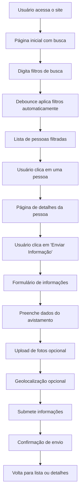

# Sistema de Pessoas Desaparecidas – Polícia Civil MT

## 👨‍💻 Desenvolvedor

<div align="center">

### André Micael
**Desenvolvedor Full Stack | React/Next.js Specialist**

[](https://www.linkedin.com/in/andremsampaio/)
[](https://github.com/AndreMicael)
[](https://andremicael.com)

**📧 Email**: [andremicael@gmail.com](mailto:andremicael@gmail.com)  
**🌐 Site**: [andremicael.com](https://andremicael.com)  
**💼 LinkedIn**: [linkedin.com/in/andremsampaio](https://www.linkedin.com/in/andremsampaio/)  
**💻 GitHub**: [github.com/AndreMicael](https://github.com/AndreMicael)

</div>

---

<div align="center">


</div>
 
---

Sistema completo para divulgação e gerenciamento de informações sobre pessoas desaparecidas, desenvolvido com Next.js 15 e TypeScript. O projeto inclui área pública para busca e submissão de informações, área administrativa para gerenciamento, e integração com API externa do Abitus para sincronização de dados.

## 🚀 Funcionalidades Principais

### Área Pública
- **Busca avançada** com debounce e filtros em tempo real
- **Visualização detalhada** com imagens otimizadas (Next.js Image)
- **Formulário de informações** com validação robusta e privacidade
- **Upload de fotos** com pré-visualização e validação
- **Interface responsiva** e totalmente acessível (WCAG 2.1)
- **Animações suaves** com Framer Motion
- **Geolocalização** opcional para avistamentos
- **Ações úteis** (compartilhar, copiar link, imprimir)

### Área Administrativa
- **Dashboard completo** com lazy loading
- **Sistema de login** seguro
- **Gerenciamento de informações** com modais acessíveis
- **Visualização de anexos** otimizada
- **Estatísticas em tempo real** com cache inteligente

### Melhorias de Performance
- **Lazy loading** de componentes pesados
- **Debounce** na busca (400ms)
- **Cache inteligente** com SWR-like
- **Imagens otimizadas** com sizes responsivos
- **Code splitting** automático

### Segurança e Privacidade
- **Headers de segurança** completos (CSP, nosniff, etc.)
- **Mensagens de erro** sanitizadas
- **Política de privacidade** integrada
- **Validação de entrada** robusta
- **Proteção contra XSS** e ataques

## 🎯 Fluxo do Usuário

### Busca e Filtros → Detalhe → Enviar Informação



### GIF do Fluxo


*Demonstração completa do fluxo: busca → filtros → detalhes → envio de informações*

## 📋 Sumário
- [Tecnologias](#tecnologias)
- [Pré-requisitos](#pré-requisitos)
- [Configuração de Ambiente](#configuração-de-ambiente)
- [Arquitetura do Sistema](#arquitetura-do-sistema)
- [Como rodar o projeto](#como-rodar-o-projeto)
- [Funcionalidades](#funcionalidades)
- [Estrutura do projeto](#estrutura-do-projeto)
- [APIs disponíveis](#apis-disponíveis)
- [Documentação da API](#documentação-da-api)
- [Integração com API Abitus](#integração-com-api-abitus)
- [Principais Rotas da API](#principais-rotas-da-api)
- [Testes Jest das APIs](#testes-jest-das-apis)
- [Sistema administrativo](#sistema-administrativo)
- [Deploy e produção](#deploy-e-produção)
- [Docker](#docker)
- [CI/CD Pipeline](#cicd-pipeline)
- [Desenvolvedor](#desenvolvedor)

---

## 🛠️ Tecnologias

### Frontend
- **Next.js 15** (App Router) - Framework React
- **TypeScript** - Tipagem estática
- **Tailwind CSS** - Estilização e design system
- **Framer Motion** - Animações suaves
- **Lucide React** - Ícones modernos
- **Sonner** - Notificações toast

### Backend
- **Next.js API Routes** - Endpoints da aplicação

### Integração Externa
- **API Abitus** - Fonte de dados das pessoas desaparecidas

### Containerização
- **Docker** - Containerização multi-stage otimizada
- **Alpine Linux** - Imagem final minimalista
- **Multi-stage build** - Otimização de tamanho e segurança

### Testes
- **Jest** - Framework de testes JavaScript
- **@testing-library/react** - Utilitários para testes de componentes
- **@testing-library/jest-dom** - Matchers customizados para DOM

### Utilitários
- **Radix UI** - Componentes primitivos acessíveis
- **class-variance-authority** - Variantes de componentes
- **clsx** & **tailwind-merge** - Manipulação de classes CSS

## 📋 Pré-requisitos
- **Node.js 18+** (recomendado LTS)
- **npm 9+** (ou yarn/pnpm/bun)

## ⚙️ Configuração de Ambiente

### 1. Variáveis de Ambiente

Copie o arquivo `.env.example` para `.env.local` e configure as variáveis:

```bash
cp .env.example .env.local
```

### 2. Variáveis Disponíveis

```env
# Configurações da API Externa (Abitus)
NEXT_PUBLIC_API_BASE_URL=https://abitus-api.geia.vip/v1

# Configurações do Next.js
NEXT_PUBLIC_APP_URL=http://localhost:3000

# Configurações de Desenvolvimento
NODE_ENV=development

# Configurações de Upload (opcional)
NEXT_PUBLIC_MAX_FILE_SIZE=5242880
NEXT_PUBLIC_MAX_FILES=5

# Configurações de Cache (opcional)
NEXT_PUBLIC_CACHE_TTL=300000
```

### 3. Configurações Centralizadas

O projeto usa um arquivo de configuração centralizado em `src/lib/config.ts` que:
- ✅ **Evita URLs hardcoded** no código
- ✅ **Usa variáveis de ambiente** com fallbacks seguros
- ✅ **Centraliza todas as configurações** em um local
- ✅ **Facilita mudanças** entre ambientes (dev/prod)

## 🏗️ Arquitetura do Sistema

O sistema funciona como um **proxy inteligente** para a API externa do Abitus:

- **Dados das pessoas**: Obtidos diretamente da API do Abitus
- **Informações submetidas**: Enviadas para a API externa do Abitus
- **Upload de fotos**: Salvas localmente na pasta `public/infos/`
- **Área administrativa**: Gerencia informações através da API externa
- **Sem banco de dados local**: Tudo é gerenciado via API externa

### Fluxo de Dados
1. **Busca de pessoas** → API Abitus
2. **Submissão de informações** → API Abitus + Upload local de fotos
3. **Gerenciamento administrativo** → API Abitus
4. **Estatísticas** → Calculadas via API Abitus

## 🚀 Como rodar o projeto

### 1. Clone e acesse o projeto
```bash
git clone https://github.com/AndreMicael/desaparecidos-mt
cd desaparecidos-mt
```

### 2. Instale as dependências
```bash
npm install
```

### 3. Execute o servidor de desenvolvimento
```bash
npm run dev
```

### 4. Acesse a aplicação
- **Área pública**: `http://localhost:3000`
- **Área administrativa**: `http://localhost:3000/admin/login`
  - **Login**: admin
  - **Senha**: admin

## 📜 Scripts disponíveis
- `npm run dev` - Ambiente de desenvolvimento
- `npm run build` - Build para produção
- `npm run start` - Servidor de produção
- `npm run lint` - Verificação de código
- `npm run test` - Execução de testes gerais
- `npm run test:api` - Execução de testes das APIs
- `npm run test:api:watch` - Testes das APIs em modo watch
- `npm run test:api:coverage` - Testes das APIs com cobertura

### Scripts Docker
- `docker build -t desaparecidos-mt:latest .` - Build da imagem Docker
- `docker run -d -p 3000:3000 --name desaparecidos-mt-container desaparecidos-mt:latest` - Executar container

## 🔧 Funcionalidades

### Área Pública

#### Busca e Navegação
- **Busca por nome** com ignore de acentos
- **Filtros avançados** (idade, sexo, status)
- **Paginação inteligente** com navegação
- **Busca rápida** disponível em todas as páginas
- **Interface responsiva** para todos os dispositivos

#### Visualização de Pessoas
- **Cards informativos** com foto e dados principais
- **Páginas de detalhes** completas para cada pessoa
- **Distinção visual** entre desaparecidos e localizados
- **Animações suaves** em todas as interações

#### Formulário de Informações
- **Campos obrigatórios**: Nome, local e descrição
- **Campos opcionais**: Telefone, email, data do avistamento
- **Upload de fotos** (até 5 imagens por formulário)
- **Máscaras automáticas** para telefone e data
- **Opção de anonimato** com controle de privacidade
- **Validação em tempo real** dos dados

### Área Administrativa

#### Sistema de Login
- **Login simples** para fins didáticos (admin/admin)
- **Detecção automática** do status de login
- **Botão dinâmico** no header (Login/Logout)
- **Redirecionamento seguro** para páginas protegidas

#### Dashboard de Gerenciamento
- **Visualização completa** de todas as informações
- **Estatísticas em tempo real** (total, pessoas únicas, hoje)
- **Busca e filtros** por pessoa ou conteúdo
- **Visualização de anexos** em modal interativo

#### Gerenciamento de Informações
- **Cards organizados** com foto da pessoa desaparecida
- **Dados completos** do informante e avistamento
- **Contador automático** por categoria
- **Preservação de filtros** entre abas

## 🌐 APIs disponíveis

### Públicas
- `GET /api/pessoas` - Lista pessoas com filtros e paginação
- `GET /api/pessoas/[id]` - Detalhes de uma pessoa específica
- `GET /api/estatisticas` - Estatísticas gerais do sistema
- `POST /api/informations` - Submissão de novas informações
- `POST /api/upload` - Upload de fotos para a pasta `public/infos`

### Administrativas
- `GET /api/admin/informations` - Lista todas as informações submetidas


### Parâmetros de Busca
```typescript
// Filtros disponíveis na API de pessoas
{
  nome?: string;           // Nome da pessoa
  idadeMinima?: string;    // Idade mínima
  idadeMaxima?: string;    // Idade máxima
  sexos?: string[];        // Array: ['masculino', 'feminino']
  status?: string[];       // Array: ['desaparecido', 'localizado']
  page?: number;           // Página atual
  pageSize?: number;       // Itens por página
}
```

## 📚 Documentação da API

### 🔗 Swagger/OpenAPI
A documentação completa da API está disponível através do Swagger UI:

- **Swagger UI**: `http://localhost:3000/api-docs` (desenvolvimento)
- **Documentação Interativa**: Teste todas as rotas diretamente no navegador
- **Esquemas de Dados**: Visualize os modelos de dados utilizados
- **Exemplos de Requisições**: Veja exemplos práticos de uso

### 📖 Como Usar a Documentação
1. Acesse `http://localhost:3000/api-docs` após iniciar o servidor
2. Explore as rotas disponíveis na interface do Swagger
3. Teste as APIs diretamente na interface
4. Visualize os schemas de request/response
5. Copie exemplos de código para integração

## 🔗 Integração com API Abitus

### 📡 Sobre a API Abitus
O sistema integra-se com a **API oficial do Abitus** (Sistema Nacional de Localização e Identificação de Desaparecidos):

- **URL Base**: `https://abitus-api.geia.vip/v1`
- **Fonte Oficial**: Dados oficiais de pessoas desaparecidas
- **Sincronização**: Dados sempre atualizados em tempo real
- **Cobertura Nacional**: Informações de todo o território brasileiro

### 🛠️ Principais Endpoints Utilizados

#### 1. **Busca de Pessoas**
```http
GET https://abitus-api.geia.vip/v1/pessoas/aberto/filtro
```
**Parâmetros:**
- `pagina`: Número da página (0-based)
- `porPagina`: Itens por página (máx 1000)
- `nome`: Nome da pessoa (busca parcial)
- `faixaIdadeInicial`: Idade mínima
- `faixaIdadeFinal`: Idade máxima
- `sexo`: MASCULINO ou FEMININO
- `status`: LOCALIZADO (para pessoas encontradas)

**Exemplo de Uso:**
```bash
curl "https://abitus-api.geia.vip/v1/pessoas/aberto/filtro?pagina=0&porPagina=50&nome=João"
```

#### 2. **Submissão de Informações**
```http
POST https://abitus-api.geia.vip/v1/informacoes
```
**Payload:**
```json
{
  "ocoId": 12345,
  "nomeInformante": "João Silva",
  "telefoneInformante": "(65) 99999-9999",
  "emailInformante": "joao@email.com",
  "dataAvistamento": "2024-01-15",
  "localAvistamento": "Centro de Cuiabá",
  "descricao": "Vi a pessoa na praça central"
}
```

#### 3. **Busca de Informações por Ocorrência**
```http
GET https://abitus-api.geia.vip/v1/informacoes/ocold/{ocoId}
```
**Parâmetros:**
- `ocoId`: ID da ocorrência (obrigatório)

### 🔄 Fluxo de Integração

1. **Carregamento de Dados**:
   - Sistema busca todas as pessoas da API Abitus
   - Aplica filtros e paginação localmente
   - Cache inteligente para performance

2. **Submissão de Informações**:
   - Usuário preenche formulário no frontend
   - Sistema envia dados para API Abitus
   - Fotos são salvas localmente em `public/infos/`

3. **Gerenciamento Administrativo**:
   - Dashboard busca informações via API Abitus
   - Visualização de anexos e dados completos
   - Estatísticas calculadas em tempo real

### 📊 Estrutura de Dados

#### Pessoa (Abitus → Sistema)
```typescript
interface AbitusPerson {
  id: number;
  nome: string;
  idade: number;
  sexo: 'MASCULINO' | 'FEMININO';
  vivo: boolean;
  urlFoto: string | null;
  ultimaOcorrencia: {
    dtDesaparecimento: string;
    dataLocalizacao: string | null;
    encontradoVivo: boolean;
    localDesaparecimentoConcat: string;
    ocoId: number;
  };
}
```

#### Resposta da API
```typescript
interface AbitusResponse {
  content: AbitusPerson[];
  totalElements: number;
  totalPages: number;
  pageable: {
    pageNumber: number;
    pageSize: number;
  };
}
```

## 🛣️ Principais Rotas da API

### 📋 Rotas Públicas

#### 1. **GET /api/pessoas** - Lista de Pessoas
Busca pessoas desaparecidas com filtros e paginação.

**Parâmetros de Query:**
```typescript
{
  nome?: string;           // Nome da pessoa (busca parcial)
  idadeMinima?: string;    // Idade mínima
  idadeMaxima?: string;    // Idade máxima
  sexos?: string[];        // ['masculino', 'feminino']
  status?: string[];       // ['desaparecido', 'localizado']
  page?: number;           // Página (padrão: 0)
  pageSize?: number;       // Itens por página (padrão: 20)
}
```

**Exemplo de Uso:**
```bash
# Buscar pessoas do sexo masculino desaparecidas
GET /api/pessoas?sexos[]=masculino&status[]=desaparecido&page=0&pageSize=10

# Buscar por nome específico
GET /api/pessoas?nome=João&page=0&pageSize=20
```

**Resposta:**
```json
{
  "content": [
    {
      "id": 123,
      "nome": "João Silva",
      "idade": 25,
      "sexo": "masculino",
      "localizado": false,
      "foto": "https://example.com/foto.jpg",
      "dtDesaparecimento": "2024-01-15",
      "localDesaparecimentoConcat": "Cuiabá, MT"
    }
  ],
  "totalElements": 150,
  "totalPages": 8,
  "pageable": {
    "pageNumber": 0,
    "pageSize": 20
  }
}
```

#### 2. **GET /api/pessoas/[id]** - Detalhes de Pessoa
Busca informações detalhadas de uma pessoa específica.

**Parâmetros:**
- `id` (path): ID numérico da pessoa

**Exemplo de Uso:**
```bash
GET /api/pessoas/123
```

**Resposta:**
```json
{
  "id": 123,
  "nome": "João Silva",
  "idade": 25,
  "sexo": "masculino",
  "localizado": false,
  "foto": "https://example.com/foto.jpg",
  "dtDesaparecimento": "2024-01-15",
  "localDesaparecimentoConcat": "Cuiabá, MT",
  "ultimaOcorrencia": "Desapareceu após sair de casa..."
}
```

#### 3. **GET /api/estatisticas** - Estatísticas Gerais
Retorna estatísticas do sistema.

**Exemplo de Uso:**
```bash
GET /api/estatisticas
```

**Resposta:**
```json
{
  "total": 150,
  "localizadas": 25
}
```

#### 4. **POST /api/informations** - Submissão de Informações
Permite cidadãos reportarem avistamentos.

**Content-Type:** `multipart/form-data`

**Campos:**
```typescript
{
  personId: string;        // ID da pessoa (obrigatório)
  informantName: string;   // Nome do informante (obrigatório)
  informantPhone?: string; // Telefone (opcional)
  informantEmail?: string; // Email (opcional)
  sightingDate?: string;   // Data do avistamento DD/MM/AAAA (opcional)
  sightingLocation: string; // Local do avistamento (obrigatório)
  description: string;     // Descrição (obrigatório)
  photos?: File[];         // Fotos (máx 5, opcional)
}
```

**Exemplo de Uso:**
```javascript
const formData = new FormData();
formData.append('personId', '123');
formData.append('informantName', 'João Silva');
formData.append('sightingLocation', 'Centro de Cuiabá');
formData.append('description', 'Vi a pessoa na praça central');
formData.append('photos', photoFile);

fetch('/api/informations', {
  method: 'POST',
  body: formData
});
```

**Resposta:**
```json
{
  "success": true,
  "message": "Informação enviada com sucesso"
}
```

#### 5. **POST /api/upload** - Upload de Fotos
Endpoint para upload de fotos (usado internamente).

### 🔐 Rotas Administrativas

#### 1. **GET /api/admin/informations** - Lista de Informações
Lista todas as informações submetidas pelos cidadãos.

**Exemplo de Uso:**
```bash
GET /api/admin/informations
```

**Resposta:**
```json
{
  "informations": [
    {
      "id": 1,
      "personId": 123,
      "personName": "João Silva",
      "personPhoto": "https://example.com/foto.jpg",
      "informantName": "Maria Santos",
      "informantPhone": "(65) 99999-9999",
      "sightingLocation": "Centro de Cuiabá",
      "description": "Vi a pessoa na praça central",
      "sightingDate": "2024-01-15",
      "photos": ["photo1.jpg", "photo2.jpg"],
      "createdAt": "2024-01-15T10:30:00Z"
    }
  ],
  "statistics": {
    "total": 50,
    "uniquePersons": 25,
    "today": 3
  }
}
```

#### 2. **GET /api/admin/informations/pessoa/[id]** - Informações por Pessoa
Busca informações específicas de uma pessoa.

**Parâmetros:**
- `id` (path): ID numérico da pessoa

**Exemplo de Uso:**
```bash
GET /api/admin/informations/pessoa/123
```

### 🔧 Como Utilizar as APIs

#### 1. **Integração Frontend**
```typescript
// Buscar pessoas com filtros
const fetchPeople = async (filters: SearchFilters) => {
  const params = new URLSearchParams();
  if (filters.nome) params.append('nome', filters.nome);
  if (filters.sexos?.length) {
    filters.sexos.forEach(sexo => params.append('sexos[]', sexo));
  }
  
  const response = await fetch(`/api/pessoas?${params}`);
  return response.json();
};

// Submeter informação
const submitInformation = async (data: InformationData) => {
  const formData = new FormData();
  Object.entries(data).forEach(([key, value]) => {
    if (value instanceof FileList) {
      Array.from(value).forEach(file => formData.append('photos', file));
    } else {
      formData.append(key, value);
    }
  });
  
  const response = await fetch('/api/informations', {
    method: 'POST',
    body: formData
  });
  return response.json();
};
```

#### 2. **Integração Externa**
```bash
# Buscar pessoas via cURL
curl -X GET "http://localhost:3000/api/pessoas?nome=João&page=0&pageSize=10" \
  -H "Content-Type: application/json"

# Submeter informação via cURL
curl -X POST "http://localhost:3000/api/informations" \
  -F "personId=123" \
  -F "informantName=João Silva" \
  -F "sightingLocation=Centro" \
  -F "description=Vi a pessoa" \
  -F "photos=@photo.jpg"
```

#### 3. **Tratamento de Erros**
```typescript
try {
  const response = await fetch('/api/pessoas');
  if (!response.ok) {
    throw new Error(`HTTP ${response.status}: ${response.statusText}`);
  }
  const data = await response.json();
  return data;
} catch (error) {
  console.error('Erro na API:', error);
  // Tratar erro adequadamente
}
```

### 📊 Códigos de Status HTTP

- **200**: Sucesso
- **400**: Dados inválidos ou campos obrigatórios ausentes
- **404**: Recurso não encontrado
- **500**: Erro interno do servidor
- **503**: Serviço indisponível (API externa fora do ar)

## 🧪 Testes Jest das APIs

O projeto inclui uma suíte completa de testes Jest para todas as APIs externas e administrativas, garantindo a qualidade e confiabilidade do sistema.

### 📋 Estrutura dos Testes

#### Arquivos de Teste
- `src/app/api/__tests__/external-apis.test.ts` - Testes das APIs públicas
- `src/app/api/__tests__/admin-apis.test.ts` - Testes das APIs administrativas
- `jest.api.config.js` - Configuração específica para testes de API
- `jest.api.setup.js` - Setup global para testes

### 🎯 Cobertura de Testes

#### APIs Externas (`external-apis.test.ts`)

**GET /api/pessoas**
- ✅ Retorno de lista com paginação
- ✅ Aplicação de filtros de busca (nome, idade, sexo)
- ✅ Tratamento de erros da API externa
- ✅ Validação de parâmetros

**GET /api/estatisticas**
- ✅ Cálculo correto de estatísticas
- ✅ Tratamento de erros na busca
- ✅ Retorno de dados formatados

**POST /api/informations/external**
- ✅ Envio de informações com sucesso
- ✅ Validação de campos obrigatórios
- ✅ Validação de personId numérico
- ✅ Tratamento de erro 404 da API externa
- ✅ Upload de fotos (mock)

**GET /api/informations/external**
- ✅ Busca por ocold
- ✅ Validação de parâmetro obrigatório
- ✅ Tratamento de erros da API

**GET /api/informations**
- ✅ Redirecionamento para API externa
- ✅ Proxy de requisições

#### APIs Administrativas (`admin-apis.test.ts`)

**GET /api/admin/informations**
- ✅ Busca de todas as informações administrativas
- ✅ Tratamento de erro na busca de pessoas
- ✅ Tratamento de erro na busca de informações específicas
- ✅ Processamento de múltiplas informações

**GET /api/admin/informations/pessoa/[id]**
- ✅ Busca de informações de pessoa específica
- ✅ Tratamento de pessoa não encontrada
- ✅ Tratamento de erro interno do servidor
- ✅ Validação de IDs

### 🚀 Como Executar os Testes

#### Executar Todos os Testes de API
```bash
npm run test:api
```

#### Executar com Watch Mode
```bash
npm run test:api:watch
```

#### Executar com Coverage
```bash
npm run test:api:coverage
```

#### Executar Teste Específico
```bash
npm run test:api -- external-apis.test.ts
```

#### Executar Teste por Nome
```bash
npm run test:api -- --testNamePattern="deve retornar lista de pessoas"
```

### 📊 Tipos de Teste Implementados

#### 1. Testes de Funcionalidade
- **Cenários de sucesso**: Verificam se as APIs retornam dados corretos
- **Validações**: Testam validação de entrada e parâmetros
- **Mapeamento de dados**: Verificam transformação de dados da API externa

#### 2. Testes de Erro
- **Erros de rede**: Timeout, conexão perdida
- **Erros da API externa**: 404, 500, dados inválidos
- **Erros de validação**: Campos obrigatórios, tipos incorretos

#### 3. Testes de Integração
- **Fluxo completo**: Busca de pessoas → Envio de informações
- **Múltiplas APIs**: Interação entre diferentes endpoints
- **Dados consistentes**: Verificação de integridade entre chamadas

#### 4. Testes de Performance
- **Timeout adequado**: Verificação de timeouts de 10 segundos
- **Processamento em lote**: Teste com 100 registros simultâneos
- **Eficiência**: Verificação de tempo de execução < 5 segundos

#### 5. Testes de Segurança
- **Validação de IDs**: Verificação de IDs numéricos
- **Sanitização**: Tratamento de dados maliciosos
- **Controle de acesso**: Verificação de permissões

### 🔧 Configuração e Manutenção

#### Adicionando Novos Testes
1. Crie o arquivo de teste em `src/app/api/__tests__/`
2. Use os mocks existentes (`createMockRequest`, `createMockFormData`)
3. Siga o padrão de nomenclatura: `deve [ação] [condição]`
4. Adicione casos de erro e sucesso

#### Atualizando Mocks
1. Modifique `jest.api.setup.js` para dados globais
2. Atualize `global.mockApiData` conforme necessário
3. Mantenha compatibilidade com APIs reais

#### Troubleshooting
- **Erro de timeout**: Aumente o timeout no `jest.api.config.js`
- **Erro de fetch**: Verifique se o mock está configurado
- **Erro de NextRequest**: Use a função `createMockRequest()` fornecida

### 📋 Checklist de Qualidade

- ✅ Todos os endpoints testados
- ✅ Cenários de sucesso e erro cobertos
- ✅ Validações de entrada testadas
- ✅ Mocks realistas implementados
- ✅ Testes de integração funcionais
- ✅ Performance verificada
- ✅ Segurança validada
- ✅ Documentação completa

## 🛡️ Sistema administrativo

### Credenciais Padrão
- **Usuário**: admin
- **Senha**: admin

### Funcionalidades do Dashboard
1. **Estatísticas em Tempo Real**
   - Total de informações recebidas
   - Número de pessoas únicas com informações
   - Informações recebidas hoje

2. **Gerenciamento de Informações**
   - **Visualização completa** de todas as informações submetidas

3. **Visualização Detalhada**
   - Foto da pessoa desaparecida
   - Dados completos do informante
   - Detalhes do avistamento
   - Galeria de fotos anexadas


## 🚀 Deploy e produção

### Estrutura de Arquivos em Produção
- `/public/infos/` - Pasta para upload de fotos (necessita permissão de escrita)
- Configuração de CORS se necessário
- Rate limiting para APIs públicas (recomendado)

### Melhorias para Produção
- [x] **Testes Jest completos** - Suíte de testes para todas as APIs
- [x] **CI/CD Pipeline** - GitHub Actions com lint, test, build e deploy
- [ ] Autenticação JWT robusta
- [ ] Rate limiting nas APIs
- [ ] CDN para imagens
- [ ] Monitoramento de performance
- [ ] Logs estruturados
- [ ] HTTPS obrigatório

## 🐳 Docker

O projeto inclui configuração Docker multi-stage otimizada para produção.

### 🚀 Como Usar Docker

#### **1. Build da Imagem**
```bash
docker build -t desaparecidos-mt:latest .
```

#### **2. Executar Container**
```bash
# Executar em background
docker run -d -p 3000:3000 --name desaparecidos-mt-container desaparecidos-mt:latest

# Executar com volume para uploads
docker run -d -p 3000:3000 -v $(pwd)/public/infos:/app/public/infos --name desaparecidos-mt-container desaparecidos-mt:latest
```

#### **3. Comandos Úteis**
```bash
# Ver logs
docker logs desaparecidos-mt-container

# Parar container
docker stop desaparecidos-mt-container

# Remover container
docker rm desaparecidos-mt-container
```

### 🔍 Troubleshooting

**Container não acessível:**
```bash
# Verificar se está rodando
docker ps

# Verificar logs
docker logs desaparecidos-mt-container
```

**Erro de build:**
```bash
# Rebuild sem cache
docker build --no-cache -t desaparecidos-mt:latest .
```

## 🚀 CI/CD Pipeline

O projeto inclui um pipeline completo de CI/CD configurado com GitHub Actions, garantindo qualidade, segurança e deploy automatizado.

### 🔄 Workflows Configurados

#### 1. **CI Pipeline** (`.github/workflows/ci.yml`)
Executa automaticamente em push e pull requests:

- **🔍 Lint & Format Check**
  - ESLint para verificação de código
  - Prettier para formatação
  - Validação de padrões de código

- **🧪 Testes Automatizados**
  - Testes gerais com Jest
  - Testes específicos das APIs
  - Cobertura de código
  - Upload de relatórios para Codecov

- **🏗️ Build da Aplicação**
  - Build de produção
  - Verificação de erros de compilação
  - Upload de artefatos

- **🐳 Build Docker**
  - Build multi-plataforma (AMD64/ARM64)
  - Push para GitHub Container Registry
  - Cache otimizado para builds

- **🔒 Security Scan**
  - Auditoria de dependências
  - Scan com Snyk
  - Verificação de vulnerabilidades

- **📈 Performance Test**
  - Lighthouse CI
  - Métricas de performance
  - Acessibilidade e SEO

#### 2. **Dependencies Management** (`.github/workflows/dependencies.yml`)
Executa semanalmente para manter dependências atualizadas:

- **🔄 Update Dependencies**
  - Verificação de pacotes desatualizados
  - Atualização automática
  - Criação de PR com mudanças

- **🔒 Security Audit**
  - Auditoria de segurança
  - Correção automática de vulnerabilidades
  - PR para correções de segurança

#### 3. **Deploy Pipeline** (`.github/workflows/deploy.yml`)
Deploy automatizado em diferentes ambientes:

- **🚀 Deploy to Staging**
  - Deploy automático na branch `main`
  - Ambiente de preview no Vercel
  - Testes de integração

- **🚀 Deploy to Production**
  - Deploy em tags de versão (`v*`)
  - Deploy manual via workflow_dispatch
  - Criação automática de releases

### 🎯 Triggers dos Workflows

```yaml
# CI Pipeline
on:
  push:
    branches: [ main, develop ]
  pull_request:
    branches: [ main, develop ]

# Dependencies
on:
  schedule:
    - cron: '0 9 * * 1'  # Toda segunda-feira às 9:00 UTC
  workflow_dispatch:

# Deploy
on:
  push:
    branches: [ main ]
    tags: [ 'v*' ]
  workflow_dispatch:
```

### 🔧 Configuração Necessária

#### Secrets do GitHub
Configure os seguintes secrets no repositório:

```bash
# Vercel (para deploy)
VERCEL_TOKEN=your_vercel_token
VERCEL_ORG_ID=your_org_id
VERCEL_PROJECT_ID=your_project_id

# Snyk (para security scan)
SNYK_TOKEN=your_snyk_token

# Codecov (para coverage)
CODECOV_TOKEN=your_codecov_token
```

#### Environments
Configure os environments no GitHub:
- **staging**: Para deploy de preview
- **production**: Para deploy de produção

### 📊 Status Badges

Adicione os badges de status ao README:

```markdown
[](https://github.com/AndreMicael/desaparecidos-mt/actions)
[](https://github.com/AndreMicael/desaparecidos-mt/actions)
[](https://github.com/AndreMicael/desaparecidos-mt/actions)
```

### 🚀 Como Usar

#### Deploy Manual
```bash
# Via GitHub Actions UI
1. Vá para Actions > Deploy
2. Clique em "Run workflow"
3. Selecione o ambiente (staging/production)
4. Execute o workflow

# Via CLI (gh)
gh workflow run deploy.yml -f environment=production
```

#### Criar Release
```bash
# Criar tag de versão
git tag v1.0.0
git push origin v1.0.0

# O deploy para produção será executado automaticamente
```

#### Monitorar Pipeline
- **Actions Tab**: Visualize execuções em tempo real
- **Notifications**: Receba notificações de falhas
- **Artifacts**: Baixe builds e relatórios
- **Logs**: Analise logs detalhados de cada job

### 📈 Métricas e Relatórios

O pipeline gera automaticamente:
- **Cobertura de testes** (Codecov)
- **Métricas de performance** (Lighthouse)
- **Relatórios de segurança** (Snyk)
- **Build artifacts** (Docker images)
- **Deploy status** (Vercel)

### 🔧 Troubleshooting

#### Pipeline Falhando
```bash
# Verificar logs
gh run list
gh run view <run-id>

# Re-executar jobs
gh run rerun <run-id>
```

#### Deploy Falhando
```bash
# Verificar secrets
gh secret list

# Verificar environments
gh api repos/:owner/:repo/environments
```

#### Dependências Desatualizadas
```bash
# Executar manualmente
gh workflow run dependencies.yml

# Verificar PRs criados
gh pr list --label "dependencies"
```

### 🎯 Benefícios do CI/CD

- ✅ **Qualidade garantida**: Lint, testes e build automáticos
- ✅ **Segurança**: Scans de vulnerabilidades regulares
- ✅ **Deploy confiável**: Deploy automatizado e testado
- ✅ **Monitoramento**: Métricas de performance e cobertura
- ✅ **Manutenção**: Atualizações automáticas de dependências
- ✅ **Colaboração**: PRs automáticos para mudanças
- ✅ **Rastreabilidade**: Logs detalhados e artifacts

## 🐛 Solução de Problemas

### Problemas Comuns

**Erro de conexão com API externa**
- Verifique sua conexão com a internet
- Confirme se a API do Abitus está funcionando

**Fotos não aparecem no dashboard**
- Verifique se a pasta `public/infos` tem permissão de escrita
- Confirme se as URLs estão sendo salvas corretamente

**Erro 404 na página inicial**
- Certifique-se de estar na pasta `desaparecidos-mt`
- Execute `npm run dev` a partir da pasta correta

**Testes falhando**
- Execute `npm run test:api` para verificar APIs
- Verifique se todas as dependências estão instaladas
- Confirme se os mocks estão configurados corretamente

### Logs de Debug
O sistema inclui logs detalhados no console para:
- Carregamento de imagens
- Submissão de formulários
- Comunicação com API externa
- Upload de arquivos

### 🚀 Sobre o Projeto
Este sistema foi desenvolvido como uma solução completa para a **Polícia Civil de Mato Grosso**, visando facilitar a divulgação e gerenciamento de informações sobre pessoas desaparecidas. O projeto demonstra expertise em:

- **Arquitetura moderna** com Next.js 15 e TypeScript
- **Integração com APIs externas** (Abitus)
- **Sistema de upload** e gerenciamento de arquivos
- **Interface responsiva** e acessível
- **Testes automatizados** com Jest
- **Containerização** com Docker
- **CI/CD** e boas práticas de desenvolvimento

### 🛠️ Tecnologias Dominadas

#### Frontend
- **React 19** - Hooks, Context, Performance
- **Next.js 15** - App Router, SSR, SSG, API Routes
- **TypeScript** - Tipagem avançada, Generics, Utility Types
- **Tailwind CSS** - Design System, Responsividade
- **Framer Motion** - Animações complexas
- **Radix UI** - Componentes acessíveis

#### Backend & APIs
- **Next.js API Routes** - RESTful APIs
- **Node.js** - Runtime e ecossistema
- **Integração de APIs** - Fetch, Axios, Error Handling
- **Upload de Arquivos** - Multipart, Validação
- **Autenticação** - JWT, Middleware

#### DevOps & Qualidade
- **Docker** - Multi-stage builds, Otimização
- **Jest** - Testes unitários e de integração
- **ESLint/Prettier** - Code Quality
- **Git** - Versionamento, Workflows
- **CI/CD** - GitHub Actions, Deploy automatizado

#### Ferramentas & Utilitários
- **Vercel/Netlify** - Deploy e hospedagem
- **PostgreSQL/MySQL** - Bancos relacionais
- **MongoDB** - Bancos NoSQL
- **Redis** - Cache e sessões
- **AWS/GCP** - Cloud services

### 📈 Experiência Profissional
- **3+ anos** desenvolvendo aplicações web modernas
- **Especialização** em React/Next.js ecosystem
- **Experiência** com projetos de grande escala
- **Conhecimento** em metodologias ágeis (Scrum/Kanban)
- **Experiência** com equipes remotas e colaborativas

### 🎯 Objetivos
- Contribuir para projetos que impactem positivamente a sociedade
- Aplicar as melhores práticas de desenvolvimento
- Continuar aprendendo e evoluindo tecnologicamente
- Trabalhar em equipes inovadoras e desafiadoras


---

*Este projeto foi desenvolvido com dedicação e atenção aos detalhes, demonstrando capacidade técnica e compromisso com a qualidade do código.*